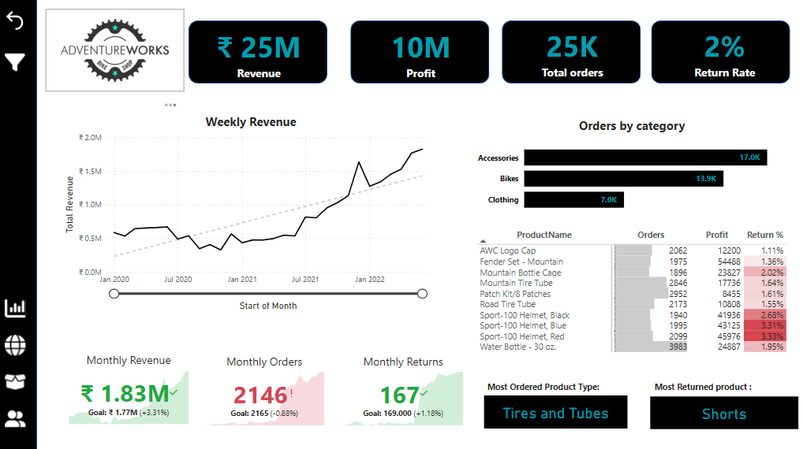
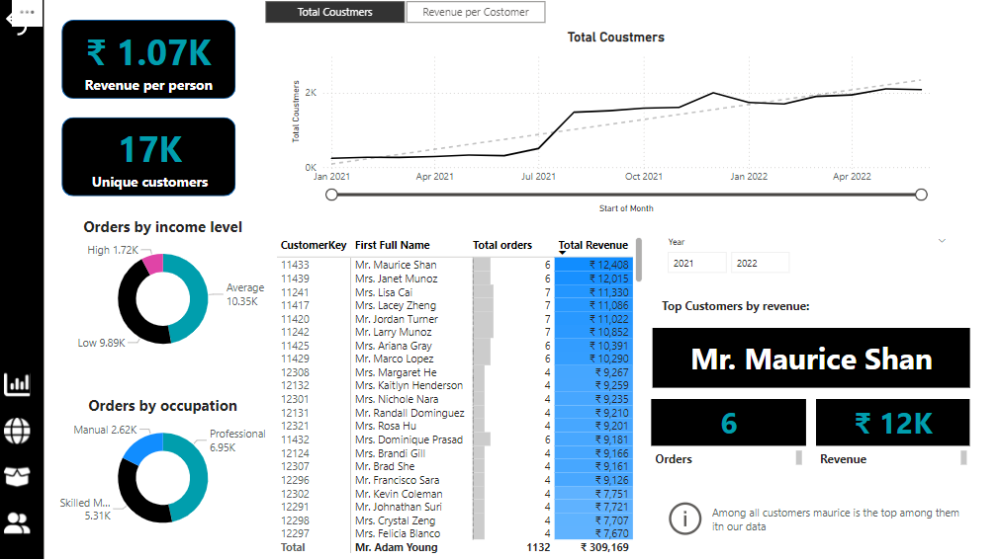
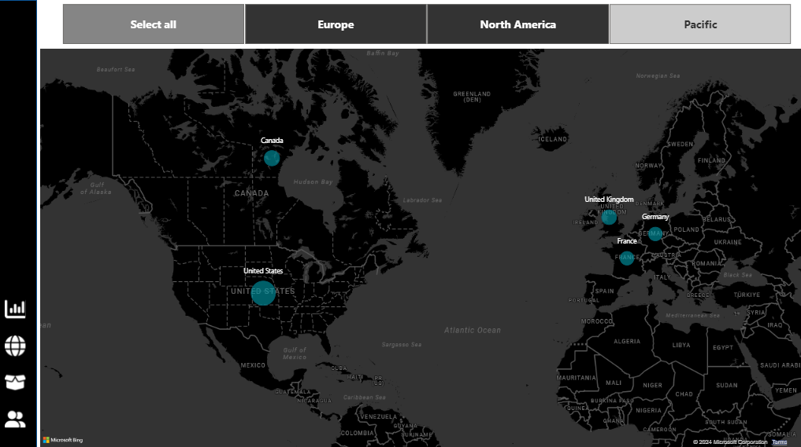
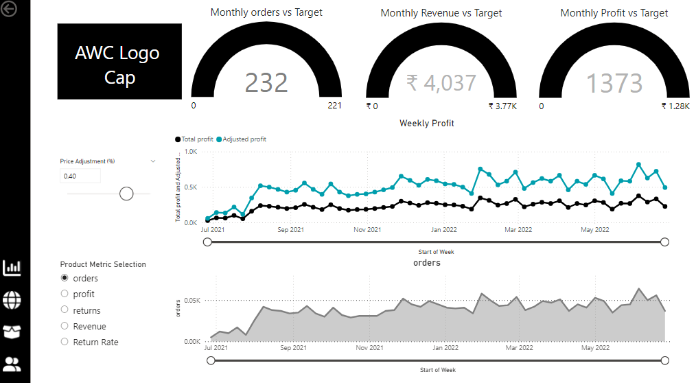

# Adventure Works Business Analysis

Welcome to the **Adventure Works Business Analysis** project! This Power BI report provides comprehensive insights into key aspects of the Adventure Works business, including customer demographics, product performance, geographical sales distribution, and overall business health. 

---

## Overview
The Adventure Works Business Analysis Power BI project helps stakeholders make informed decisions by visualizing data trends and patterns. It covers:
- Customer segmentation and behavior
- Sales and product performance
- Geographical sales distribution
- Key business metrics and KPIs

---

## Features
- Interactive and user-friendly dashboards
- Dynamic filtering for in-depth data analysis
- Geo-mapping to visualize regional sales performance
- Customer insights to enhance decision-making strategies
- Product performance tracking for inventory and sales optimization

---

## Screenshots
### 1. Main Dashboard  
  
The **Main Dashboard** offers a high-level view of key business metrics, including total revenue, sales trends, and profitability.

### 2. Customer Dashboard  
  
The **Customer Dashboard** provides insights into customer demographics, purchasing patterns, and segmentation.

### 3. Map Dashboard  
  
The **Map Dashboard** visualizes sales distribution across regions using geospatial data.

### 4. Product Dashboard  
  
The **Product Dashboard** highlights product performance metrics, inventory levels, and sales contributions.

---

## How to Use
1. Open the Power BI `.pbix` file.
2. Navigate through the dashboards using the tabs at the bottom.
3. Use filters to customize the data view (e.g., by product, region, or time period).
4. Analyze the visualizations to identify trends and insights.

---

## Requirements
- **Power BI Desktop** (latest version recommended)
- Data source: [Adventure Works Dataset](https://www.microsoft.com/en-us/download/details.aspx?id=57787)

---

## Contact
**Chaitanya Sai Nutakki**  
